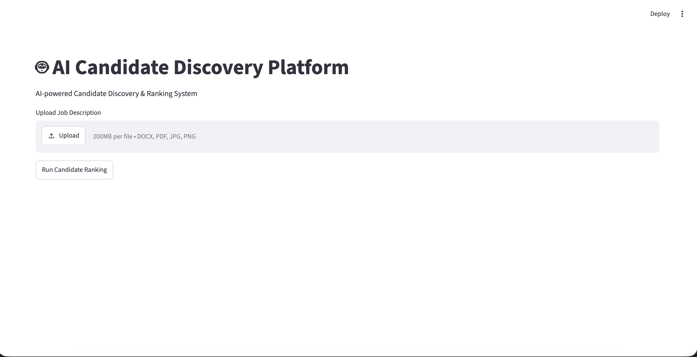
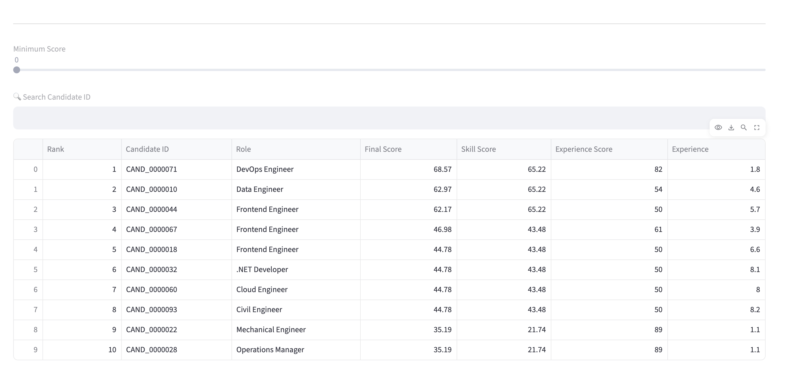
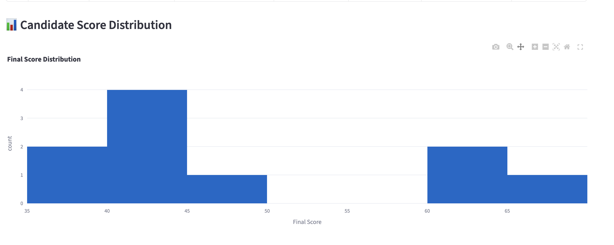
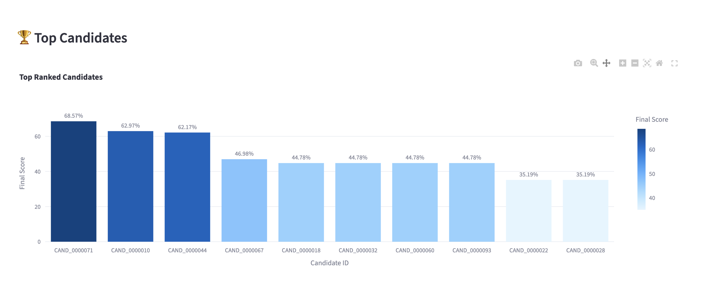

# 🤖 AI Candidate Discovery Platform

An AI-powered Candidate Discovery & Ranking System that automatically analyzes Job Descriptions, extracts candidate features, performs semantic skill matching, ranks candidates, and provides explainable AI recommendations through an interactive Streamlit dashboard.

---

## 🚀 Features

- 📄 Multi-format Job Description Parsing (PDF, DOCX, Images)
- 📑 Resume Parsing
- 🧠 Semantic Skill Matching
- ⚖️ Weighted Skill Scoring
- 👨‍💼 Candidate Ranking Engine
- 🤖 AI Recommendation Engine
- 📊 Interactive Dashboard
- 📈 Candidate Analytics
- 📥 CSV Export
- 🔍 Candidate Filtering

---

## 🛠 Tech Stack

### Backend
- Python
- Streamlit
- Pandas
- Plotly

### AI / NLP
- Sentence Transformers
- Semantic Similarity
- OCR (Tesseract)

### Data
- JSON
- CSV

---

## 📂 Project Structure

```
AI-Candidate-Ranker/
│
├── src/
│   ├── dashboard/
│   ├── engines/
│   ├── parsers/
│   ├── semantic/
│   ├── explainability/
│   ├── models/
│   ├── pipeline/
│   └── knowledge/
│
├── data/
├── outputs/
├── screenshots/
├── uploads/
├── requirements.txt
└── README.md
```

---

## ⚙️ Installation

Clone the repository

```bash
git clone <your-github-url>
cd AI-Candidate-Ranker
```

Create Virtual Environment

```bash
python -m venv .venv
```

Activate

### Windows

```bash
.venv\Scripts\activate
```

### macOS/Linux

```bash
source .venv/bin/activate
```

Install dependencies

```bash
pip install -r requirements.txt
```

Run the application

```bash
streamlit run src/dashboard/app.py
```

---

## 📸 Screenshots

### Dashboard



### Ranking Table



### Candidate Score Distribution



### Top Candidates



### Candidate Details


---

## 🎯 Future Enhancements

- Resume Upload & Live Ranking
- LLM-based Resume Analysis
- Email Notifications
- ATS Resume Scoring
- Interview Question Generator
- Recruiter Portal
- Cloud Deployment

---

## 👨‍💻 Author

**Anuj Suryawanshi**

B.Tech Artificial Intelligence & Data Science

GitHub: https://github.com/aannuuujj